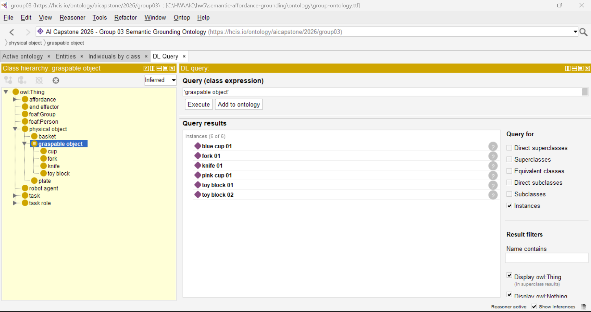

# Homework 5 Report — Ontology-based Semantic Grounding

**Group 03** · AI Capstone 2026
_Members: 徐畹茜 (112550122), 莊蕓安 (112550110), 李尹瑄 (112550032), 黃襄香 (112550123), 曾歆喬 (112550045), 謝欣陵 (112550115)_

---

## 1. Goal and design rationale

A learned manipulation policy operates over pixels, poses, and trajectories,
but it has no explicit notion of *why* an object can be picked up. This homework
adds a **semantic grounding layer**: it represents each perceived object as a
typed, role-bearing, affordance-carrying entity, and then lets a reasoner decide
graspability. The guiding principle is to **define** graspability once, as an
OWL axiom, and let every object be classified by that single rule — rather than
tagging objects "graspable" by hand.

We deliberately keep four layers distinct, because conflating them is the most
common modeling error:

- **Object type** — what the thing *is* (`cap:Cup`).
- **Task role** — what it *does in a task* (`cap:TargetObject` vs.
  `cap:ReferenceObject` vs. `cap:ContainerTarget`).
- **Affordance** — what *manipulation it supports* (`cap:GraspingAffordance`).
- **Instance** — the concrete object in the scene (`g03:blueCup01`).

A fifth layer, the **inferred class** `cap:GraspableObject`, is produced only by
reasoning.

## 2. Namespace policy

| Prefix | Namespace | Role |
|--------|-----------|------|
| `cap:` | `https://hcis.io/ontology/aicapstone/2026/` | Shared course vocabulary, **imported**. |
| `g03:` | `https://hcis.io/ontology/aicapstone/2026/group03/` | Group-authored individuals and affordance instances. |

The group ontology declares its own ontology IRI, title, description, creator,
creation date, license, and preferred-namespace metadata (mirroring the course
ontology's metadata block). The course ontology is imported via `owl:imports`,
resolved locally through `catalog-v001.xml`.

## 3. Reused vs. newly introduced terms

**Reused from `cap:` (unchanged):**
`cap:PhysicalObject`, `cap:EndEffector`, `cap:ManipulationTask`,
`cap:Cup`, `cap:Knife`, `cap:Fork`, `cap:Plate`, `cap:ToyBlock`, `cap:Basket`;
the affordance classes `cap:GraspingAffordance`, `cap:StackabilityAffordance`,
`cap:SupportAffordance`, `cap:ContainmentAffordance`; the task-role classes
`cap:TargetObject`, `cap:ReferenceObject`, `cap:ContainerTarget`,
`cap:CollectableObject`; and the properties `cap:hasAffordance`,
`cap:hasTaskRole`, `cap:hasTargetObject`, `cap:canBeManipulatedBy`,
`cap:hasColor`, `cap:hasObjectLabel`, `cap:hasPoseFrame`, `cap:hasApproxWidth`.
These reused declarations also provide the required `owl:ObjectProperty`,
`owl:DatatypeProperty`, and `rdfs:subClassOf` resources via `owl:imports`, rather
than being re-declared under `g03:`.

**Newly introduced:**

- The **OWL axiom for `cap:GraspableObject`**: we add the `owl:equivalentClass` /
  `owl:intersectionOf` / `owl:someValuesFrom` axiom. `cap:GraspableObject` is a
  course-level term, so we add only its axiom, not a new class under `cap:`.
- **Group individuals** under `g03:`: the seven baseline objects plus two toy
  blocks, their affordance individuals, an end effector `g03:gripper01`, and a
  task instance `g03:cupStackingTask`.

## 4. Key axioms and restrictions

The course classes carry **necessary conditions** as existential restrictions,
e.g.:

```turtle
cap:Cup rdfs:subClassOf cap:PhysicalObject ,
    [ a owl:Restriction ; owl:onProperty cap:hasAffordance ;
      owl:someValuesFrom cap:GraspingAffordance ] ,
    [ a owl:Restriction ; owl:onProperty cap:hasAffordance ;
      owl:someValuesFrom cap:StackabilityAffordance ] .
```

The reasoning target is a **defined class** (necessary *and* sufficient):

```turtle
cap:GraspableObject owl:equivalentClass [
    a owl:Class ;
    owl:intersectionOf (
        cap:PhysicalObject
        [ a owl:Restriction ; owl:onProperty cap:hasAffordance ;
          owl:someValuesFrom cap:GraspingAffordance ] ) ] .
```

The difference matters: the `Cup` restriction *says* a cup has a grasping
affordance; the `GraspableObject` equivalence *says* anything that is a physical
object with a grasping affordance **is** a graspable object. The biconditional is
what lets a reasoner classify individuals **into** `cap:GraspableObject`.

## 5. Reasoning pattern and results

Description Logic form:

```
cap:GraspableObject ≡ cap:PhysicalObject ⊓ ∃ cap:hasAffordance.cap:GraspingAffordance
```

**Two confirming inference paths:**

1. **OWL 2 DL (Protégé + HermiT).** From `cap:Cup ⊑ cap:PhysicalObject` and
   `cap:Cup ⊑ ∃hasAffordance.GraspingAffordance`, HermiT derives the class-level
   subsumption `cap:Cup ⊑ cap:GraspableObject`. Every cup individual then gets
   `cap:GraspableObject` as an inferred type. The same holds for `Knife`, `Fork`,
   and `ToyBlock`. `Plate` (support) and `Basket` (containment) are **not**
   subsumed.

2. **OWL 2 RL (`owlrl`, reproducible).** Each graspable instance is explicitly
   linked to a `cap:GraspingAffordance` individual. Rules `cls-svf1`
   (someValuesFrom membership), `cls-int1` (intersection membership), and
   `cax-eqc` (equivalent-class transfer) classify the individual as
   `cap:GraspableObject`.

**Inferred result (6 graspable objects):**

```
g03:block01   (toy_block, CollectableObject)
g03:block02   (toy_block, CollectableObject)
g03:blueCup01 (blue_cup,  TargetObject)
g03:fork01    (fork,      TargetObject)
g03:knife01   (knife,     TargetObject)
g03:pinkCup01 (pink_cup,  TargetObject)
```

`g03:plate01` and `g03:basket01` are correctly excluded.

**Inferred class membership (Protégé + HermiT):**



*Figure 1 — The six environment individuals (blue/pink cups, knife, fork, two toy blocks) are inferred as `cap:GraspableObject`; `g03:plate01` and `g03:basket01` are correctly excluded.*

## 6. Design choices

- **Plate and basket are NOT graspable.** A plate is a placement *reference* and a
  basket is a *container target*; in our task framing the gripper does not pick
  them up. We model this by giving them support / containment affordances only —
  the ontology *derives* their non-graspability instead of us hard-coding it.
- **Explicit affordance individuals.** We assert affordance individuals on each
  object even though the class restrictions already imply them. This makes the
  affordance layer concrete and queryable, and makes the graspability inference
  robust across both DL (HermiT) and RL (owlrl) reasoners.
- **`owl:imports` + catalog.** Keeps the course vocabulary as a clean imported
  dependency while remaining resolvable offline.

## 7. Limitations and future work

- **Single-gripper assumption.** Graspability is modeled qualitatively. We record
  `cap:hasApproxWidth`, but do not yet constrain graspability by gripper aperture.
  A future `(hasApproxWidth ≤ gripperMaxWidth)` constraint (SWRL / SHACL) could
  refine it.
- **OWL-RL vs. OWL-DL.** The `owlrl` path needs the explicit affordance
  individuals; the pure class-subsumption inference requires a DL reasoner. We
  document both rather than relying on one.
- **No deformability / mass.** Suggested advanced extensions (SPEC §19) such as
  deformability, mass estimates, or linking instances to live simulation frames
  are out of scope for this submission.
- **SKOS alignment is documentation-only.** The `course-alignment.ttl` mappings
  (e.g. `cap:GraspingAffordance skos:relatedMatch soma:Grasping`) provide
  traceability to CORA / SOMA / KnowRob but do not drive reasoning.

## 8. Reproducibility

```bash
pip install rdflib owlrl
python src/reason_and_query.py
```

produces `ontology/inferred-results.ttl` and
`results/graspable_objects_output.txt`. The Protégé + HermiT workflow yields the
same classifications plus the screenshots in `results/screenshots/`.
